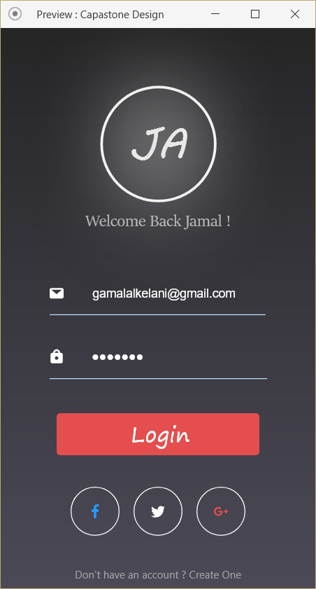
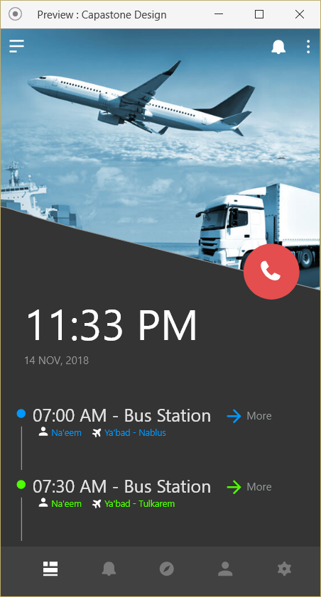
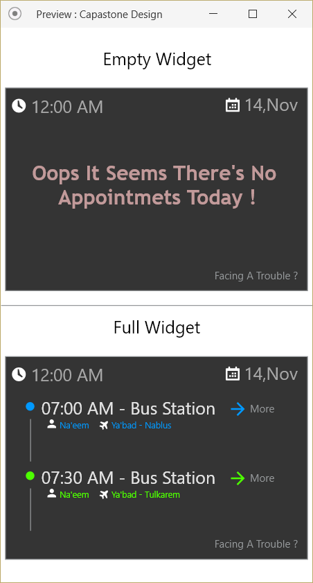
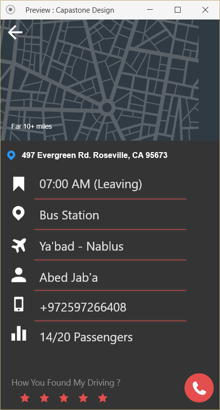

# ADNP7_CapstoneProject
<b>Bus Tracking App Using GPS<b>

This project is developed as the final capastone project of Android Developer Nanodegree in order to graduate.

the app keeps track of the driver and when ever the driver enters the user location (geofence) the user gets notified that the driver is close to his home. Also, the driver can add any appointments for bus leaving events.

# Activities

1.Home Screen (shows realtive information about upcoming trips and the ability to add your geofence location) 
2.Login Screen (authentication screen for the app) 
3.Detalis Screen (shows more information about he upcoming trips, including the abilbity to call the driver direcctly and eploring where is he using GPS). 
4.Widgets (the user have the ability to see the upcoming trips using a small widget outside the app) 

# Screenshots

  
 

* This project meets all the requirements needed to graduate from Android Developer Nanodegree.

* The Design was made first on Adobe XD, then on Android Studio.
